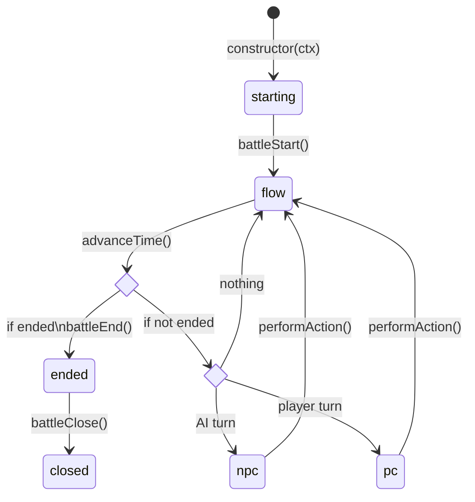

[(IDEA configuration to view these diagrams)](https://www.jetbrains.com/help/idea/markdown.html#diagrams)

# CombatController <-> BattleContext relation

BattleContext - UI, player interaction, time management.

CombatController - combat rules, state changes, AI, action implementations.

BattleContext triggers CombaController events.

```mermaid
sequenceDiagram
    participant pc as Game UI
    participant ctx as BattleContext
    participant cc as CombatController
    participant gc as GameController
    
    Note over gc: startBattle()
    activate gc
    gc ->>+ ctx: new BattleContext
    ctx ->>- cc: new CombatController
    Note over cc: state="started"
    gc ->>+ ctx: ctx.update()
    ctx ->>- cc: cc.battleStart()
    Note over cc: state="flow"
    cc ->>+ ctx: stateChanged("flow")
    ctx ->> pc: ctx.redraw()
    Note over ctx: ctx.scheduleTick()
    ctx -->- gc: 
    deactivate gc
    
    Note over pc,gc: Time flows, nothing happens
    
    gc ->>+ ctx: ctx.animationFrame() -> ctx.tick()
    ctx ->>+ cc: cc.advanceTime()
    Note over cc: state="flow"
    cc -->- ctx: 
    Note over ctx: if state is unchanged
    ctx ->> pc: ctx.redraw()
    Note over ctx: ctx.scheduleTick()
    deactivate ctx
    
    Note over pc,gc: Time flows, AI turn
    
    gc ->>+ ctx: ctx.animationFrame() -> ctx.tick()
    ctx ->>- cc: cc.advanceTime()
    activate cc
    Note over cc: state="npc", nextActor=monster
    cc ->> +ctx: stateChanged("npc")
    deactivate cc
    ctx ->> pc: ctx.redraw()
    Note over ctx: Pause 500 ms
    ctx ->>- cc: cc.advanceTime(0)
    activate cc
    Note over cc: cc.performAiAction(nextActor)
    Note over cc: cc.performAction()
    Note over cc: (game logic)
    Note over cc: state="flow"
    cc ->> +ctx: stateChanged("flow")
    deactivate cc
    ctx ->> pc: ctx.redraw()
    Note over ctx: ctx.scheduleTick()
    deactivate ctx
    
    Note over pc,gc: Time flows, new round
    
    gc ->>+ ctx: ctx.animationFrame() -> ctx.tick()
    ctx ->>+ cc: cc.advanceTime()
    Note over cc: cc.nextRound()
    Note over cc: state="flow"
    cc -->- ctx: 
    Note over ctx: if state is unchanged
    ctx ->> pc: ctx.redraw()
    Note over ctx: ctx.scheduleTick()
    deactivate ctx
    
    Note over pc,gc: Time flows, PC turn
    
    gc ->>+ ctx: ctx.animationFrame() -> ctx.tick()
    ctx ->>- cc: cc.advanceTime()
    activate cc
    Note over cc: state="pc", nextActor=player
    cc ->> +ctx: stateChanged("pc")
    deactivate cc
    ctx ->>- pc: ctx.redraw()
    Note over pc: Controls are enabled
    
    Note over pc: Player clicks a button
    pc ->>+ ctx: ctx.execAction()
    ctx ->>- cc: cc.performAction()
    activate cc
    Note over cc: (game logic)
    Note over cc: cc.battleEnd()
    Note over cc: cc.cleanupAferCombat()
    Note over cc: state="ended"
    cc ->>+ ctx: stateChanged("ended")
    deactivate cc
    ctx ->>- pc: ctx.redraw()
    Note over pc: Display [Finish] button 
    
    Note over pc,gc: Player clicks [Finish]
    
    pc ->> ctx: ctx.onBattleFinishClick()
    ctx ->>+ cc: cc.battleClose()
    opt if victory
        Note over cc: cc.awardLoot()
        cc ->> gc: gc.openTransferMenu(loot)
    end
    Note over cc: state="closed"
    cc ->>- ctx: ctx.stateChanged("closed")
    activate ctx
    Note over ctx: Destroy context
    ctx ->>- gc: gc.showGameScreen()
```

# CombatController state flowchart

